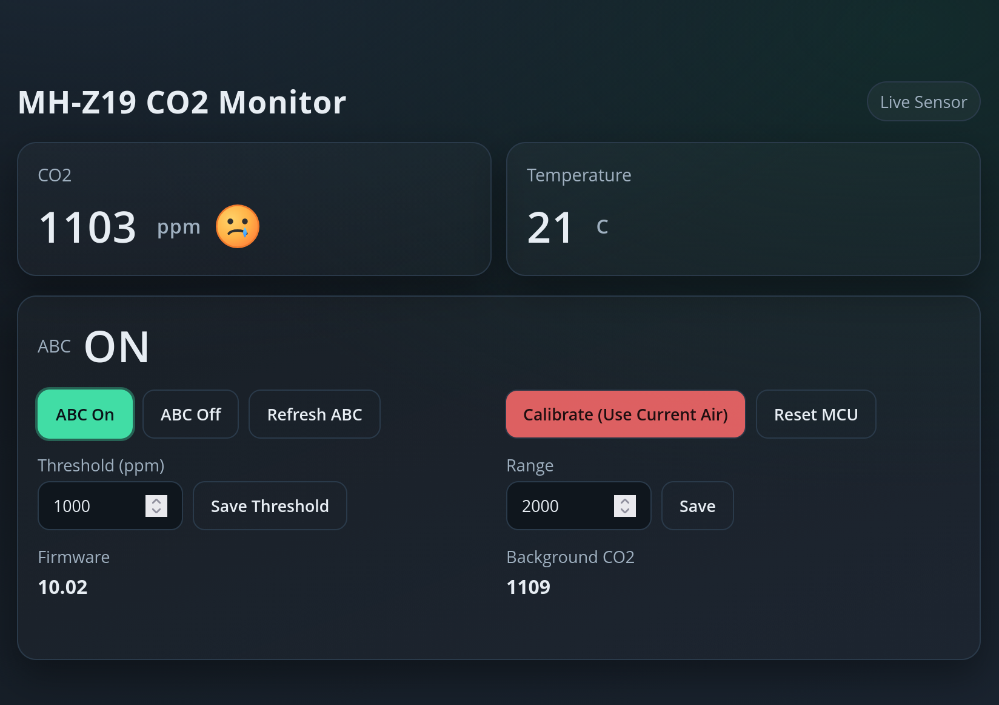

# CO2 MH-Z19 (E) sensor with Async Webserver on ESP32

MH-Z19 CO2 sensor monitor and control dashboard running on ESP32.

Tested with ESP32-S2 Mini.

**Overview**
- Reads CO2 (ppm) and temperature from MH-Z19 every 2 seconds.
- Serves a responsive web UI with live values and controls.
- Saves settings in NVS (Preferences) so they persist across reboots.
- Supports ABC toggle, calibration, threshold setting, and range setting.

**Defaults**
- Threshold: 1000 ppm.
- Range: 2000 ppm.
- ABC: enabled.
- Calibration cooldown: 10 seconds.

**Persistence**
- Stored in NVS: `threshold`, `range`, `abc`, `cal_ms`, `fw`.

**Hardware**
- ESP32 board (tested with ESP32-S2 Mini).
- MH-Z19 family CO2 sensor with UART interface.

**Wiring**
- `RX_PIN` on the ESP32 connects to sensor TX.
- `TX_PIN` on the ESP32 connects to sensor RX.
- `GND` to `GND`.
- `VCC` to the sensor power input (follow the sensor datasheet).
- `LED_PIN` uses the board built-in LED.

Pin defaults are defined near the top of `co2/co2.ino`. Adjust `RX_PIN` and `TX_PIN` to match your board and wiring. The code comments include a note for ESP32-S2 pin alternatives.

**Setup**
1. Open `co2/co2.ino` in the Arduino IDE (it will pull in `co2/html.ino`).
2. Set Wi-Fi credentials in `co2/co2.ino` (`staSsid` and `staPassword`).
3. Install required libraries (included in `libraries/` or via Library Manager): `MH-Z19`, `AsyncTCP`, `ESPAsyncWebServer`.
4. Select your ESP32 board and upload.
5. Open Serial Monitor at `115200` to see logs and the device IP.

**Wi-Fi Behavior**
- Tries to join the configured Wi-Fi for ~10 seconds.
- If it fails, it starts an access point (SSID `MHZ19-AP`, password `12345678`).
- The Serial Monitor prints the IP for either mode.

**Web UI**
- Open the device IP in a browser to view live readings and controls.
- The UI lives in `co2/html.ino` and is served from `/`.

**API Endpoints**
- `GET /data` returns JSON: `co2`, `temp`, `mood`, `threshold`, `range`, `abc`, `calRemainingMs`, `fw`.
- `POST /abc` with `enabled=true|false` turns ABC on or off.
- `GET /abc/refresh` reads ABC status from the sensor.
- `POST /calibrate` calibrates using current air (~400 ppm). Cooldown is 10 seconds.
- `POST /threshold` with `value=<ppm>` sets the threshold (clamped to 400..5000).
- `POST /range` with `value=<ppm>` sets the range (clamped to 1000..10000).
- `GET /background` reads background CO2.
- `POST /reset` restarts the MCU.

**LED Behavior**
- Solid on when CO2 is below the threshold.
- Pulsing when CO2 is above the threshold.

**Files**
- `co2/co2.ino` main firmware logic and routes.
- `co2/html.ino` embedded web UI.
- `libraries/` bundled dependencies.

**Build**

You can find archived version of [libraries](libraries/) in this repository. The project uses ESP32 board definitions by Espressif in version 3.3.7. Links to original libraries:

* https://github.com/ESP32Async/AsyncTCP
* https://github.com/ESP32Async/ESPAsyncWebServer
* https://github.com/WifWaf/MH-Z19

# License
Creative Commons Attribution-NonCommercial-ShareAlike 4.0 International (CC BY-NC-SA 4.0). Please refer to the [license](https://creativecommons.org/licenses/by-nc-sa/4.0/). The author is not liable for any damage caused by the software. Usage of the software is completely at your own risk.